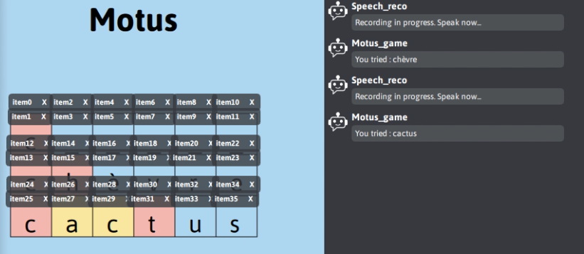

# Motus with speech regonition

This repo is a little game like the real game Motus but with some speech recognition. This app uses Ingescape by Ingenuity.io

This repo is an UPSSITECH 3A project.

Author : Julian TRANI & Pauline JOBERT

## Install

You need to have python with python 3.10 recommended and `ingesacape` lib installed.
You need open the `Speech_reco_motus.igsplatform` with the `Ingescape Circle` software 

Download the Whiteboard app [here](https://ingescape.com/upssitech/Whiteboard.zip), and put it on the repo and then run `.\Whiteboard\Whiteboard.exe --device Wi-Fi` to launch the Whiteboard

## Run 

You need to add a parameter to run a python agent.

With pycharm go to => Edit Configuration => parameters => Write `--device Wi-Fi` => save

